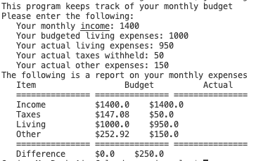

# helloWorld
## Overview
This program allows the User to input their budgets for the month and shows a graph of the total budget and actual expenses.
## Development Environment
* VS Code
* Java

## Execution
to compile this promgram put:
```java
javac Budget.java
```
To run put: 
```java
java Budget
``` 
Information should then be entered into the program.
The ouput is like this:  



## Useful Websites

[Here](https://stackoverflow.com) is Stack Overflow that helped me with this project.

[Here](https://www.java.com/en/) is the website for Java.